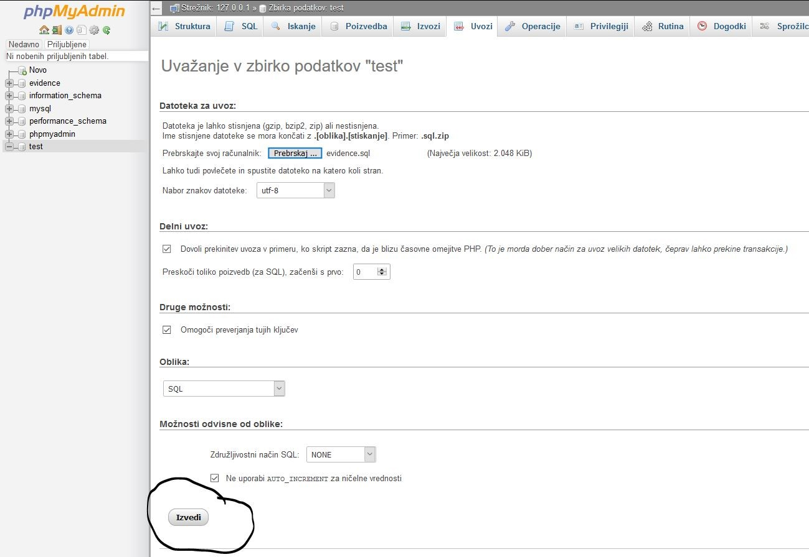

# EvidenceBuddy  

Projekt je bil izdelan z željo nuditi potrošniku možnost sledenja in upravljanja z njegovim gradivom. Tako smo naredili spletno rešitev, ki to rešitev nudi.

### Predpogoji za zagon

Za zagon aplikacije morate imeti nameščene stvari:
Wamp/Xampp

[WAMP](http://www.wampserver.com/en/)
[XAMPP](https://www.apachefriends.org/index.html)

### Namestitev

* 1. Prenesite si projekt v ZIP obliki in ga razširite.

* 2. Prenesite si program XAMPP ki ga najdete na link-u. Po končani namestitvi zaženite program in v programu zaženite Apache in MySQL strežnika s pritiskom na gumb start.
 

* 3. Pojdite v lokalni disk (ponavadi je označen s C:) in poiščite mapo XAMPP, ter jo odprite.

* 4. V mapo htdocs kopirajte celoten razširjen projekt.

* 5. Sedaj v poljuben brskalnik vpišite (http://localhost/80). Oziroma port na katerem vam deluje strežnik. Odpre se vam XAMPP stran na kateri pritisnite PhpMyAdmin. Nato s pritiskom na gumb **UVOZI** izberite razširjen projekt in v njem izberite MySql datoteko evidence ter pritisnite gumb **IZVEDI**.

* 6. Sedaj v poljuben brskalnik vpišite (http:// vaš lokalni IP naslov /Evidence_Izposojenega_Gradiva/index.php). Vaš lokalni IP naslov lahko preverite tukaj [MyIP](https://www.whatismyip.com/). 

## Funkcionalnosti

* Prijava/Registracija
* Dodajanje/Izposoja/Vrnitev/Pregled gradiva
* Sporočanje med uporabniki
* Spreminjanje gesla
* Dodajanje slike gradiva
* Hitra povezava na socialne medije
* Prilagojena mobilna verzija rešitve

## Verzija programske opreme uporabljene pri izdelavi rešitve (link za namestitev)

[XAMPP](https://www.apachefriends.org/download_success.html). 

## Uporabljena tehnologija za izdelavo

* [PhpStorm](https://www.jetbrains.com/phpstorm/)
* [XAMPP](https://www.apachefriends.org/index.html)
* [NotePad++](https://notepad-plus-plus.org/)
* [GitLab](https://about.gitlab.com/)
* [MySql](https://www.mysql.com/)

## Ustvarjalci

* **Niko Hustić**
* **Filip Edšid**
* **Jan Markovič**