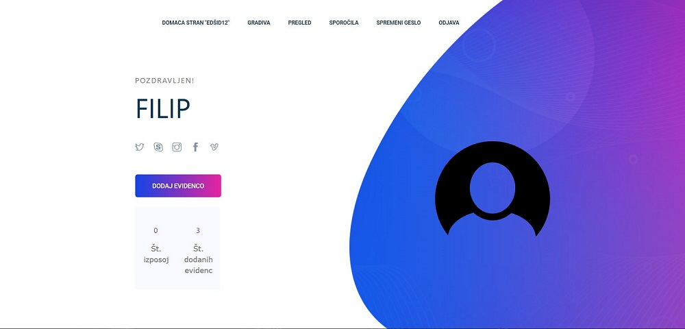
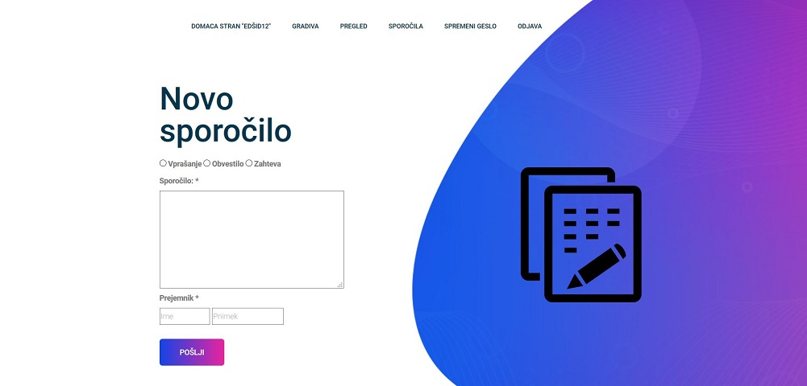

# EvidenceBuddy  

Projekt je bil izdelan z željo nuditi potrošniku možnost sledenja in upravljanja z njegovim gradivom. Tako smo naredili spletno rešitev, ki to rešitev nudi.

### Predpogoji za zagon

Za zagon aplikacije morate imeti nameščene stvari:
Wamp/Xampp

[WAMP](http://www.wampserver.com/en/)
[XAMPP](https://www.apachefriends.org/index.html)
[PHPStorm](https://www.jetbrains.com/phpstorm/)
[MySql](https://www.mysql.com/)

### Namestitev

## Funkcionalnosti

* Prijava/Registracija
* Dodajanje/Izposoja/Vrnitev/Pregled gradiva
* Sporočanje med uporabniki
* Spreminjanje gesla
* Dodajanje slike gradiva
* Hitra povezava na socialne medije
* Prilagojena mobilna verzija rešitve

## Izdelano z

* [PhpStorm](https://www.jetbrains.com/phpstorm/)
* [XAMPP](https://www.apachefriends.org/index.html)

## Verzija programske opreme uporabljene pri izdelavi rešitve (link za namestitev)

[XAMPP](https://www.apachefriends.org/download_success.html). 

## Uporabljena tehnologija

* MySql
* PHPStorm
* XAMPP
* Notepad++
* GitLab

## Avtorji

* **Niko Hustić**
* **Filip Edšid**
* **Jan Markovič**